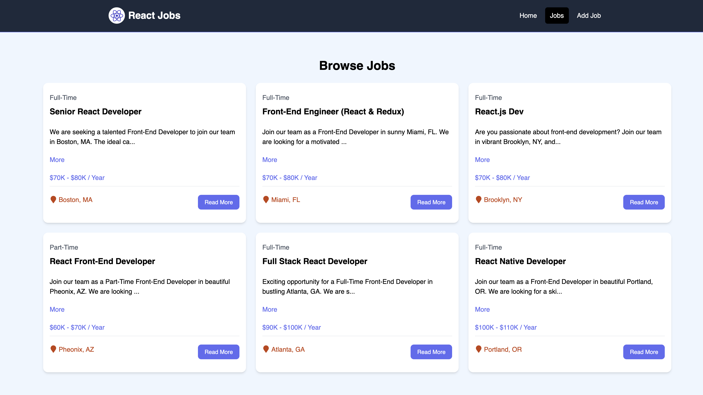

# React Jobs Project



## Usage

This project uses JSON-Server for a mock backend.

### Install Dependencies

```bash
npm install
```

### Run JSON Server

The server will run on http://localhost:8000

```bash
npm run server
```

### Run Vite Frontend

React will run on http://localhost:3000

```bash
npm run dev
```

### Build for Production

```bash
npm run build
```

### Preview Production Build

```bash
npm run preview
```

This React app appears to be a job listing platform focused on React-related developer roles. Based on the interface, here’s a summary of its functionality and potential CRUD operations it could support:

### Key Features are:
1. **Job Listing Display**: The app presents a list of jobs in a card layout, showing details such as:
   - Job title and type (e.g., "Full-Time," "Part-Time").
   - Brief description.
   - Salary range.
   - Location.
   - A "Read More" button that might lead to a detailed job view.

2. **Navigation**: 
   - Top navigation includes links for **Home**, **Jobs**, and **Add Job**. The "Add Job" link suggests that users might have the ability to add new job postings.

3. **Responsive Design**: 
   - The grid layout indicates it’s designed to handle multiple jobs and could potentially adapt to various screen sizes.

### Possible CRUD Operations:

1. **Create (Add Job)**:
   - The "Add Job" link likely leads to a form where users can input new job details, such as title, job type, location, salary, and description. 
   - This form would add a new job entry to the job list upon submission.

2. **Read (Browse Jobs)**:
   - Users can view a list of all available job postings with essential details shown in cards.
   - Clicking "Read More" might open a detailed view for each job post, showing full information.

3. **Update (Edit Job)**:
   - Although not explicitly visible, an Edit function could be implemented for admins or job posters to modify details of an existing job (e.g., salary, description, location).

4. **Delete (Remove Job)**:
   - Similar to editing, there may be a Delete function (likely restricted to specific users) to remove job postings that are no longer relevant or filled.

### Futher working on Potential Improvements:
- **Search and Filter**: Adding filters for location, salary, or job type would improve usability for job seekers.
- **User Authentication**: Implementing user roles (e.g., admin or job poster) could restrict certain CRUD operations to authorized users.
- **Job Application Feature**: Adding a way for users to apply to jobs directly could enhance the app’s value.

### Summary:
This app likely serves as a job board for React developers, with potential CRUD functionality allowing users to add, view, update, and delete job listings. It's a practical tool for managing job postings and helping developers find relevant positions.
